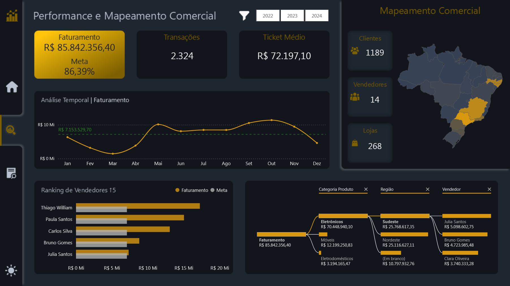

# 🏪 Projeto Comercial — NovaCasa Retail

## 📊 Visão Geral

Este projeto apresenta um **dashboard estratégico desenvolvido em Power BI** para análise de **desempenho comercial e distribuição geográfica de vendas** da empresa fictícia **NovaCasa Retail**.

A solução consolida indicadores essenciais de vendas e permite analisar **faturamento, desempenho de vendedores, comportamento de clientes e distribuição regional das vendas**, fornecendo suporte analítico para decisões comerciais.

🔎 [Dashboard Interativo](https://app.powerbi.com/view?r=eyJrIjoiNGYwMWMyNjQtNzdmMi00MzcyLWFmNzUtMzhjMmY2MTRhM2MzIiwidCI6IjIzY2FjN2VlLWYxZDgtNDMzOS1hYTdiLTc4MWFhOWY5MjI1YiJ9)  

---

# 🧠 Contexto do Problema

A **NovaCasa Retail** buscava compreender com maior precisão o desempenho de suas operações comerciais em diferentes regiões do país.

Apesar da existência de registros de vendas, faltava uma **visão analítica consolidada** que permitisse acompanhar indicadores estratégicos como:

- faturamento total  
- desempenho de vendedores  
- comportamento de clientes  
- distribuição geográfica das vendas  

Essa ausência dificultava a identificação de **padrões comerciais, tendências de vendas e oportunidades de expansão regional**.

---

# 🎯 Abordagem Estratégica

Para atender a essa necessidade foi desenvolvido um **dashboard estratégico em Power BI**, estruturado com **modelagem dimensional** para consolidar e organizar os dados comerciais.

A solução integra métricas fundamentais como:

- **Faturamento Total**
- **Quantidade de Transações**
- **Ticket Médio**
- **Desempenho de Vendedores**
- **Distribuição Geográfica das Vendas**

Essa estrutura analítica permite realizar **análises comparativas entre regiões, vendedores e períodos**, facilitando a identificação de tendências e oportunidades de melhoria no desempenho comercial.

---

# 📊 Estrutura do Dashboard

O projeto foi desenvolvido utilizando **padrão visual em Dark Mode** e apresenta **navegação por menu lateral esquerdo**, permitindo alternar entre as páginas analíticas e o modo de visualização **Dark/Light**.

---

# 🏠 Página Home

A página inicial apresenta uma **visão executiva do desempenho comercial**.

### Elementos principais

Menu lateral com navegação para:

- Home
- Performance e Mapeamento Comercial
- Detalhamento Comercial
- Alternância entre **Dark Mode e Light Mode**

Indicadores estratégicos:

- **Faturamento Total**
- **Maior Faturamento por Vendedor**
- **Menor Faturamento por Vendedor**

Essa página funciona como **painel executivo inicial**, permitindo uma rápida avaliação da performance comercial.

---

# 📈 Página Performance e Mapeamento Comercial

Essa página apresenta uma **análise estratégica do desempenho de vendas** combinada com **inteligência geográfica de mercado**.

### Indicadores principais

Cartões de indicadores:

- **Faturamento vs Meta**
- **Quantidade de Transações**
- **Ticket Médio**

### Análises visuais

- **Gráfico de área** com evolução temporal do faturamento
- Indicação da **média de faturamento**
- **Ranking dos Top 5 vendedores** em gráfico de barras horizontais
- **Visual de Inteligência Artificial** para identificação de padrões relevantes nos dados

### Mapeamento Comercial

Uma área dedicada à análise geográfica apresenta:

Indicadores estratégicos:

- Quantidade de Clientes
- Quantidade de Vendedores
- Quantidade de Lojas

Visual geográfico:

- **Mapa do Brasil** com distribuição do faturamento por região
- Representação por **gradação de cores**, permitindo identificar regiões com maior concentração de receita

Essa combinação de análises possibilita compreender **como o desempenho comercial se distribui territorialmente**.

---

# 📑 Página Detalhamento Comercial

A página de detalhamento apresenta uma **análise operacional aprofundada das vendas**.

### Indicadores principais

Cartões com:

- **Faturamento**
- **Quantidade de Transações**
- **Ticket Médio**

### Tabela Analítica

Tabela detalhada contendo:

- Nome do Vendedor
- Faturamento
- Quantidade Vendida

### Análises adicionais

Visualizações disponíveis:

- **Gráfico de rosca** com participação percentual do faturamento por região  
  - Sul  
  - Sudeste  
  - Nordeste  
  - Norte  
  - Centro-Oeste  

- **Gráfico de barras horizontais** com quantidade de transações por gênero  
  - Masculino  
  - Feminino  

- **Gráfico de barras verticais** com comparativo mensal de transações por gênero

- **Gráfico de área** comparando:
  - evolução do faturamento  
  - quantidade vendida mês a mês  

O gráfico também destaca **os períodos de maior e menor desempenho comercial**.

---

# 🛠️ Tecnologias Utilizadas

- **Power BI** — desenvolvimento das visualizações e construção do dashboard  
- **DAX** — criação de métricas como faturamento total, ticket médio e indicadores comparativos  
- **Linguagem M (Power Query)** — transformação e preparação dos dados  
- **Modelagem Dimensional** — estruturação das tabelas de vendas, clientes, vendedores e regiões  
- **Data Storytelling** — organização narrativa das análises para facilitar interpretação estratégica  
- **Business Intelligence** — suporte analítico para tomada de decisão comercial

---

# 📈 Conexão com Estratégia Comercial

A solução fortalece a análise estratégica da **NovaCasa Retail** ao oferecer uma **visão integrada do desempenho comercial da empresa**.

As análises permitem:

- avaliar a contribuição de vendedores para o faturamento  
- identificar regiões com maior potencial de mercado  
- compreender o comportamento de diferentes perfis de clientes  
- acompanhar o desempenho comercial ao longo do tempo  

Esses insights apoiam decisões relacionadas a:

- **expansão regional**
- **estratégias de vendas**
- **gestão de metas comerciais**
- **otimização da força de vendas**

---

# 📸 Preview do Dashboard

## Documentação das Medidas

Para consultar a documentação das medidas deste projeto, suas fórmulas e descrições, acesse a [Documentação das Medidas](docs/medidas-documentacao.md).

# 👨‍💻 Autor

Projeto desenvolvido como parte do meu portfólio profissional em **Business Intelligence e Data Analytics**, destacando habilidades avançadas e aplicáveis a diversos cenários analíticos:

- Desenvolvimento de **dashboards executivos e painéis estratégicos**, focados em insights acionáveis e tomada de decisão baseada em dados  
- **Modelagem dimensional e relacional**, aplicando corretamente **cardinalidade, granularidade** e hierarquias entre tabelas para garantir consistência e integridade dos dados  
- **Transformação de dados com Power Query e Linguagem M**, criando pipelines eficientes, automatizados e auditáveis  
- Criação de **KPIs estratégicos e métricas customizadas em DAX**, para análise de performance e comparações confiáveis  
- **Integração de múltiplas fontes de dados** (Excel, SQL, APIs, arquivos planos), padronizando e validando informações críticas  
- **Data storytelling e visualizações interativas**, com cores, hierarquias, filtros e destaque de insights, para facilitar interpretação e engajamento do usuário  
- **Análises estatísticas e preditivas**, usando Python, R, regressões, teste de hipóteses, séries temporais e técnicas de Machine Learning para identificação de tendências e padrões  
- **Automatização e otimização de processos analíticos**, incluindo ETL, scripts e compressão de dados, garantindo performance e escalabilidade dos relatórios  
- **Documentação detalhada de medidas, tabelas, modelos e processos**, permitindo reprodutibilidade, transparência e governança dos dados  
- Aplicação de **boas práticas de engenharia de dados**, integrando análise, estatística, IA e visualização para soluções analíticas completas e confiáveis  
- Domínio completo de **Power BI, DAX, Power Query, Python e R**, com foco em performance, qualidade e entrega de insights estratégicos

---

  
**Portfólio de Business Intelligence & Data Analytics**  

| [LinkedIn](https://www.linkedin.com/in/rogério-clynton-ribeiro/) | [Portfólio](https://clyntonboss.github.io/) |

